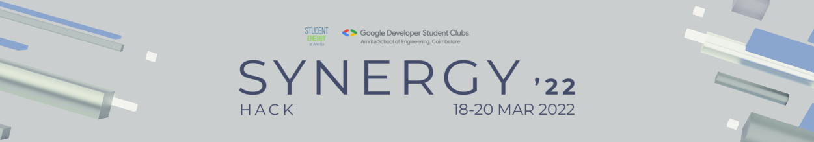

[](https://app.netlify.com/sites/synergyhack22/deploys)

## Setup

Download [Node.js](https://nodejs.org/en/download/). Run the following commands:

```bash
# Install dependencies (only the first time)
pnpm i

# Run the local server at localhost:8080
pnpm run dev

# Build for production in the dist/ directory
pnpm run build
```

## License

MIT
